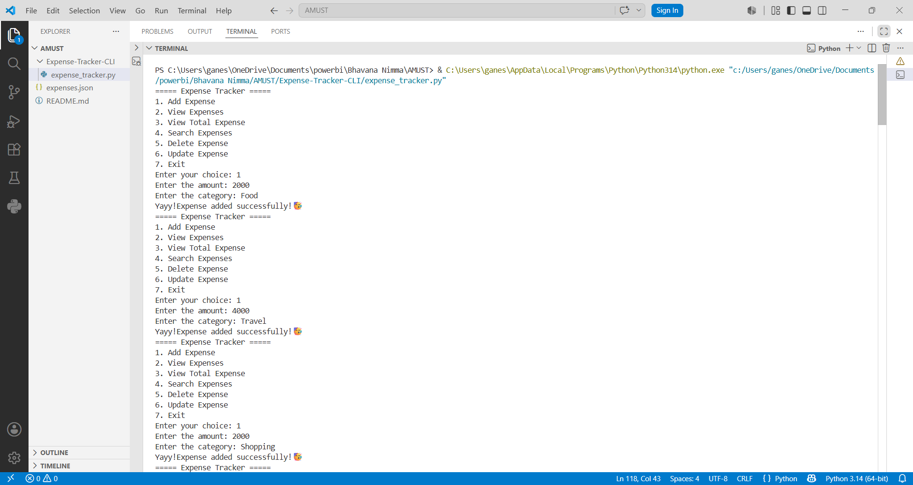
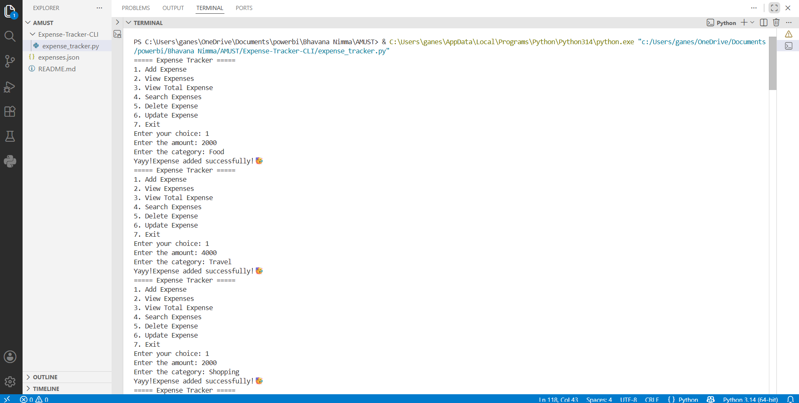
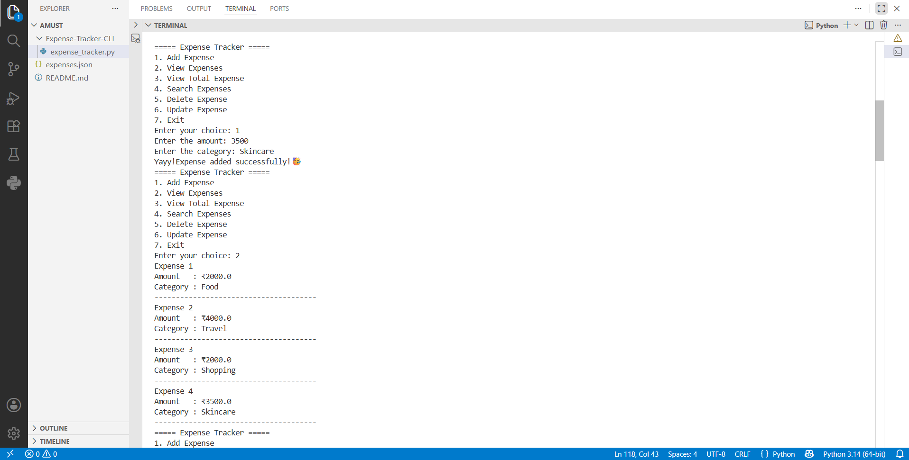
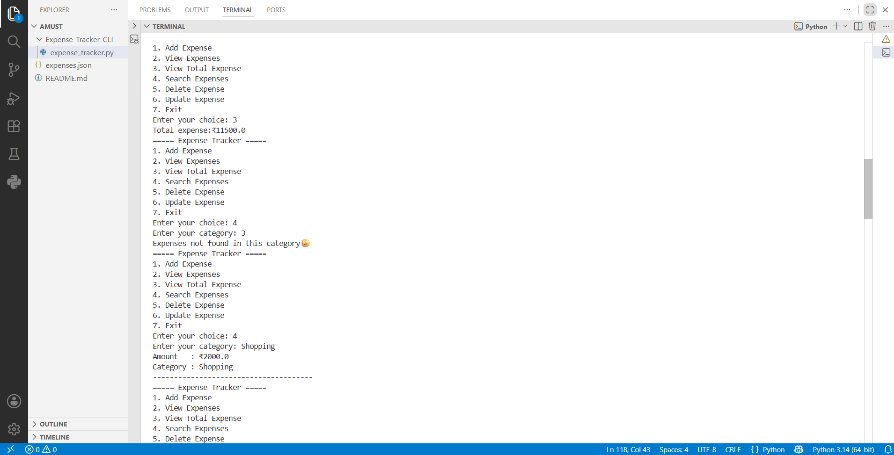
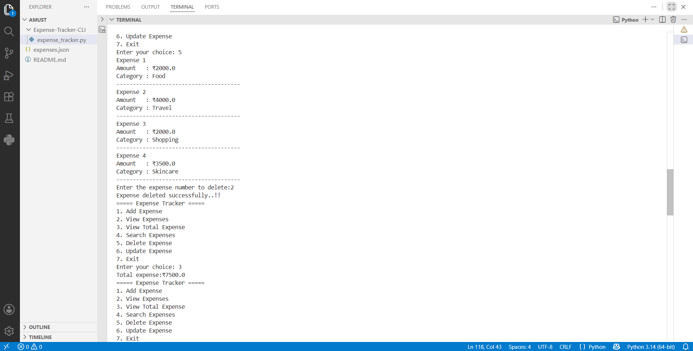
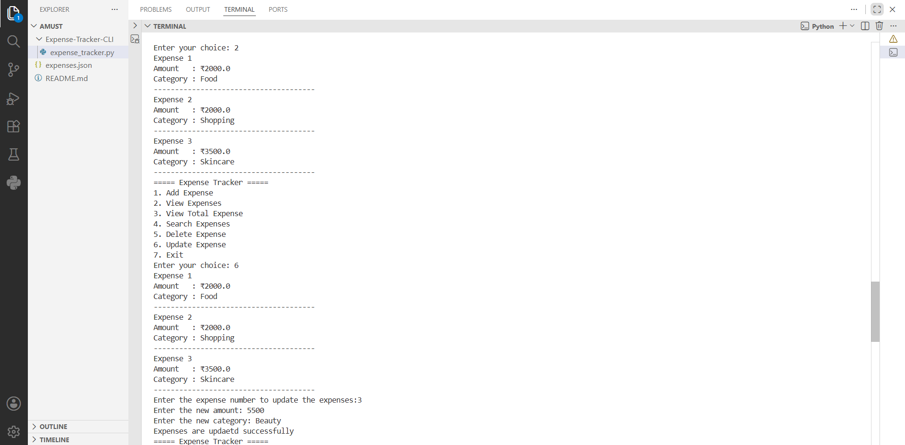
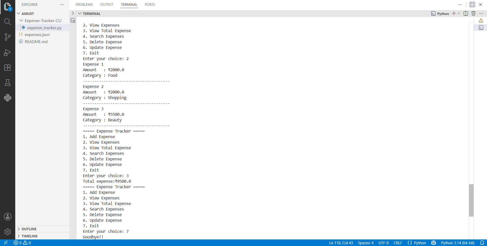

💰 Expense Tracker

A simple command-line Expense Tracker built with Python. This application helps users manage their daily expenses by allowing them to add, view, search, update, and delete expense records. All data is stored in a JSON file, so expenses are preserved between program runs.

🚀 Features

* ➕ Add new expenses
* 📋 View all expenses
* 💰 Calculate total expenses
* 🔍 Search expenses by category
* ✏️ Update existing expenses
* 🗑️ Delete expenses
* 💾 Save and load data using JSON

🛠️ Technologies Used

* Python 3
* JSON (for data storage)

📂 Project Structure

```text
Expense-Tracker
│
├── expense_tracker.py
├── expenses.json
└── README.md
```


▶️ How to Run

1. Make sure Python 3 is installed.
2. Download or clone this repository.
3. Open a terminal in the project folder.
4. Run the program:

```bash
python expense_tracker.py
```

📖 Menu Options


1. Add Expense
2. View Expenses
3. View Total Expense
4. Search Expenses
5. Delete Expense
6. Update Expense
7. Exit

📸 Screenshots
1. Main Menu


2. Add Expense



3. Expense Added Successfully



4. View All Expenses



5. View Total Expenses



6. Search Expenses by Category



7. Update Expense



8. Delete Expense



📌 Future Improvements

* Add date and time for each expense
* Monthly expense reports
* Budget tracking and alerts
* Expense summaries with charts
* Category-wise statistics
* CSV and Excel export

👩‍💻 Author

Bhavana Nimma

GitHub: https://github.com/bhavananimma2606
